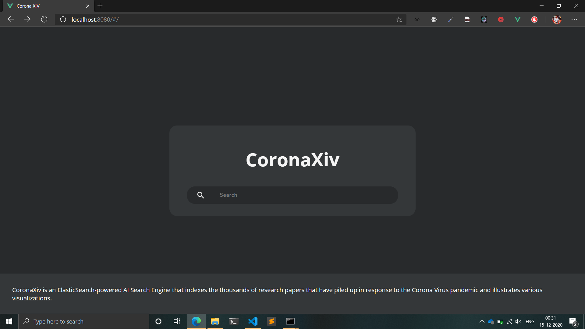

<h1 align="center">:microscope::chart_with_upwards_trend: CoronaXiv :mortar_board::bookmark_tabs:</h1>

 

 

---

<b>Submission for HackJaipur Hackathon 2020.</b> 

<h2>About:</h2>

CoronaXiv is an ElasticSearch-powered AI Search Engine that indexes the thousands of research papers that have piled up in response to the Corona Virus pandemic and illustrates various visualizations.

<h2>Problem it solves:</h2>

A lot of researchers are working remotely across the globe, where lockdown restrictions are varying. Some researchers are working in labs, while some are working from home. In order to assist them in their endeavor to help defeat the Corona Virus pandemic, it would be really handy for any researcher to have a dedicated search-engine for Covid-19 papers, and also get links to other similar papers which are AI-recommended, so that it saves their time. Every second is precious in this battle against this global pandemic and hence, we have built CoronaXiv, an ElasticSearch-powered AI Search Engine for research papers related to the Corona Virus. 
In the current scenario, one would perform Google search in order to look for some research papers. However, more often than not, certain keywords will yield results not related to the Corona Virus pandemic, and also lack UX since the user has to switch from one paper to another every time by going back to the home screen. With CoronaXiv, one can directly access the papers easily, with different visualizations to assist the user in understanding relations of different papers and identify papers based on keywords, or access papers clustered on basis of similar domains. 

### Features:

* [x] AI-powered ElasticSearch based Search Engine for Covid-19 papers. 
* [x] Filters on basis of peer review, covid/non-covid, date, etc. is provided. 
* [x] Graph plot of related papers shown in clusters, to help identify papers related to each other.  
* [x] Additional metadata information provided to help researchers understand the importance of the suggested papers.  
* [x] Works as a PWA. 
* [x] Mobile-view support.

---

<h3 align="center">CoronaXiv as a webapp:</h3>

<h4 align="center">Home Page</h4>

 

---

### Future scope of this project:

* [ ] Provide more comprehensive metadata for each paper. 
* [ ] Improve search time of results fetched. 
* [ ] Provide more insights thorugh different graph visualizations. 
* [ ] Host on AWS/Azure for faster model deployment.
* [ ] Suggest more research papers based on the one you are currently reading using LDA.

### Tech Stack of this Project:

* Frontend: Vue.js
* Backend: Python3
* Framework: Flask, PyTorch
* Machine Learning Model: K-means Clustering, Covid-BERT
* Libraries: Available in [requirements.txt](https://github.com/arghyadeep99/CoronaXiv/blob/master/requirements.txt).

### To run the project:

* [Fork](https://github.com/arghyadeep99/CoronaXiv) this Repository.
* Change into he directory in the terminal and run as:
  -`pip3 install -r requirements.txt`
  -`python3 manage.py runserver`
* Open your web browser and enter the following URL:
`localhost:8000`

#### This project still has scope of development, so you can also contribute to this Project as follows:
* [Fork](https://github.com/nachiketbhuta/exsports-analytics) this Repository.
* Clone your Fork on a different branch:
	* `git clone -b <name-of-branch> https://github.com/arghyadeep99/CoronaXiv.git`
* After adding any feature:
	* Goto your fork and create a pull request.
	* We will test your modifications and merge changes.

This project was done as a part of HackJaipur Hackathon 2020 `remotely with no pre-preparation in less than 32 hours under lockdown.`

---
<h3 align="center"><b>Developed with :heart: by Team Stochastic.</b></h1>
